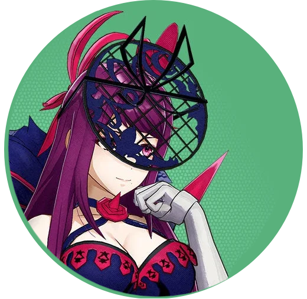
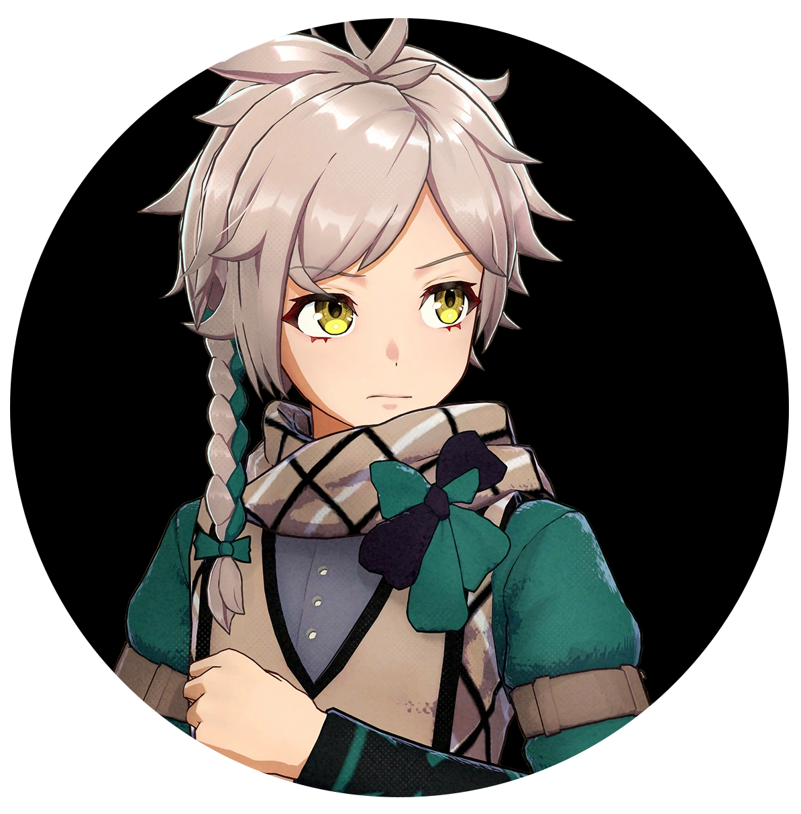
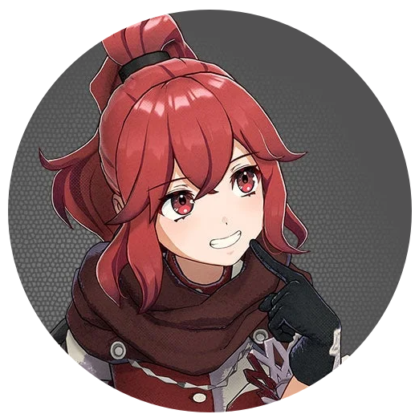
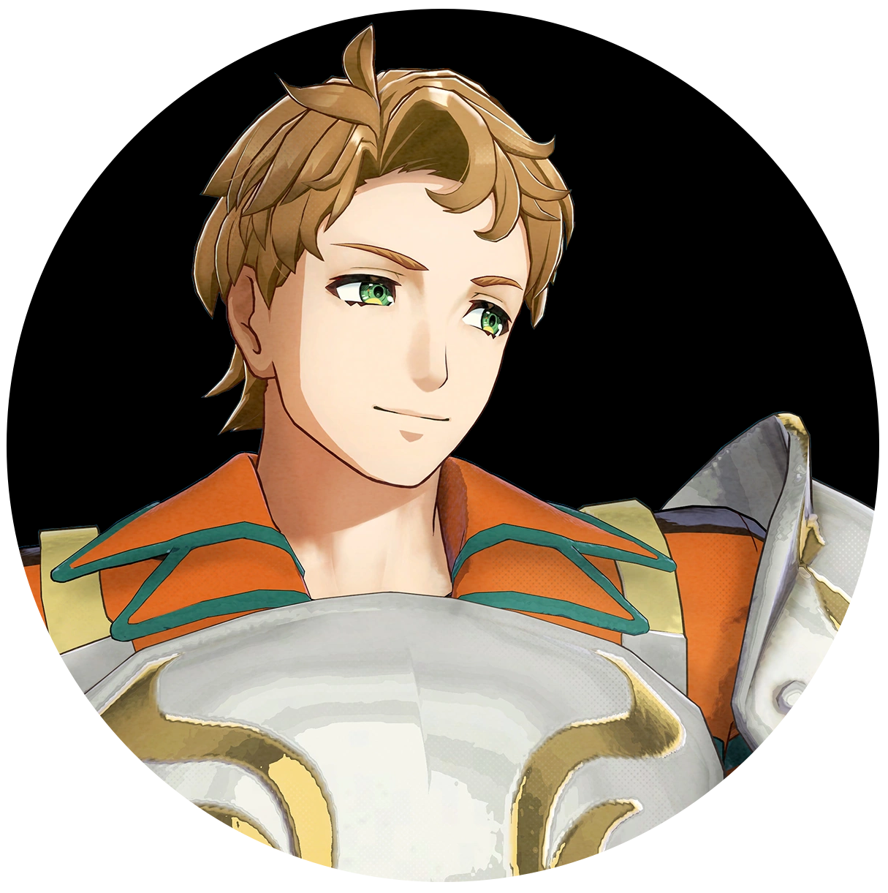
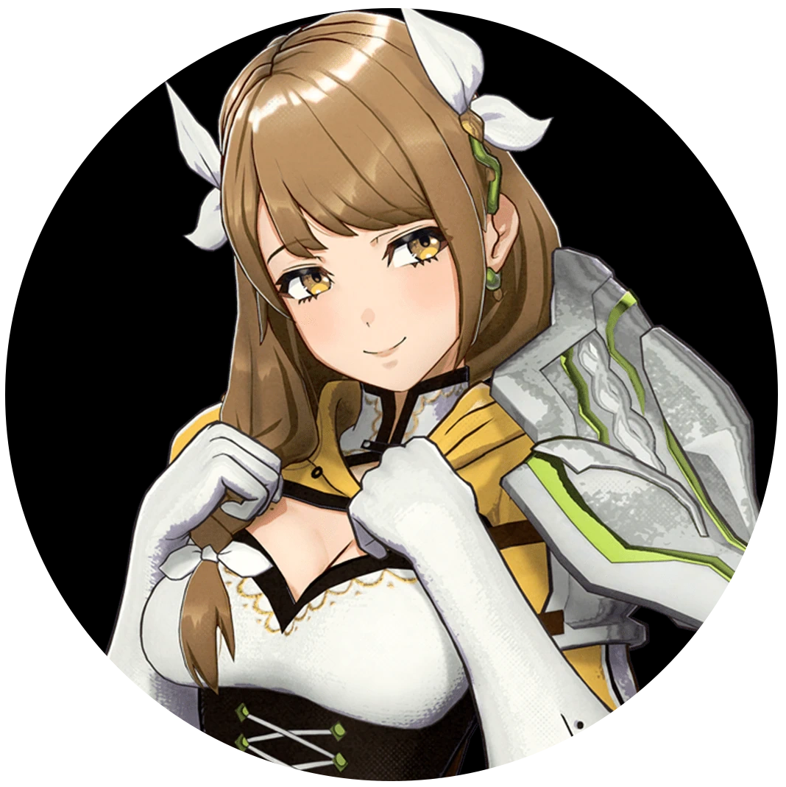
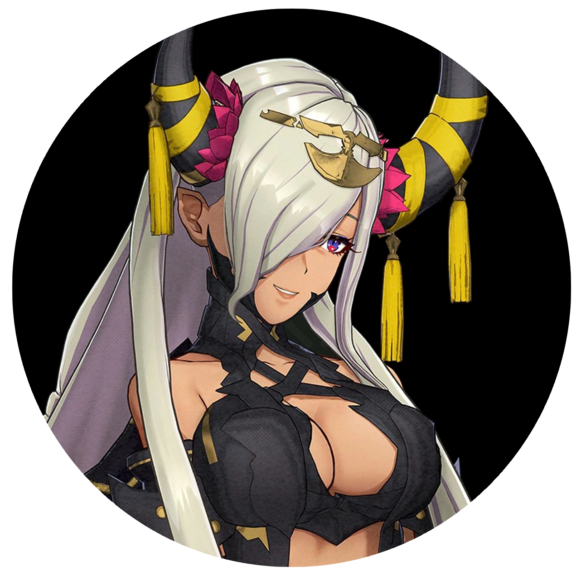

Wow. Where do I start?

My first Fire Emblem game, like many people, was Three Houses: a tale of three friends forced to fight each other as their nations butted heads. A thick, complicated intrigue wound around every chapter and character motive, leaving me at the edge of my seat, wondering what bizarre but impactful thing would happen next. The score was fantastic, the characters were (mostly) lovable, the four-way split of story paths ensured at least four times the replayability, and the gameplay was solid tactical combat that only overstayed its welcome if you went out of your way to do everything and suck the game of every combat mission you could. The game generated near universal acclaim, making it a standout in its series.

Now:

Where do you go from there?

What new ideas can you bring to the table? Maybe we have a story about a rival kingdom being misled into attacking your homeland, killing someone close to the protagonist. Then, when it's revealed that it was all a mistake and the kingdom wants to make amends, the protagonist, in a fit of fury, denies the aid, and declares war, sending the two nations into bloody battle after bloody battle. The protagonist soon realizes that his passion for revenge is short-lived, and that, though he considered himself a hero, he's become the villain, as more and more of his allies perish in the war he created.

OR!

How about this?

There's a bad guy called the "Fell Dragon" who tried to destroy the world, and he was successfully sealed away for a thousand years. But, to everybody's surprise, the seals have weakened, the Fell Dragon has awakened, and he's using an army of reanimated corpses (the "corrupted") to wage war against the entire effing world, and YOU are the ONLY ONE who can STOP HIM!

And how do you do it?

Why, with the *power of friendship* of course!

WHAT A NOVEL CONCEPT!

The first inkling that things were going to be rough was when the bad guy (who could not be more visibly the bad guy if the designers tried) says his first line of dialogue to the protagonist:

>You're here - at your end. This place will be your tomb.

Right out the gate, we're starting with a cliche.

...okay, the real point where I realized it'd be rough was the J-Rock intro music video vaguely telling you the backstory. But we're getting sidetracked!

From Three Houses, we're plonked into a generic fantasy world where one kingdom is exclusively full of green meadows and flowers, one kingdom is the rocky, ore-rich one (can you guess the population's general demeanor?), one kingdom is entirely snowy, despite being at the same latitude as the rocky kingdom, and one kingdom is a desert. The entire kingdom is a desert, despite there being no mountains on the eastern coast. Yeah, yeah, it's fantasy, it doesn't have to make sense, I know, shut up.

This land is called "Elyos," and it’s presided over by a Divine Dragon named Lumera. And the protagonist (henceforth "Takahiro," as that's what I name all my JRPG protagonists) is her son. Takahiro was asleep for one thousand years, and he woke up just in time for Sombron, the Fell Dragon, to awaken.

Lumera and Takahiro are reunited after a millennium of waiting, but, oh no! Takahiro has amnesia! Who'da thunk? How inconvenient, and yet convenient at the same time.

But the good news is that Lumera takes him under her wing (despite being called the "Divine Dragon," she only turns into a dragon once, so this is only half a pun). She tells him all about the wonderful things they'll do together now that she can finally spend time with him. Oh, they'll go on long walks, share meals, have lengthy chats about life and its wonders -

*OOPS* she gets killed by the bad guys and motivates the protagonist to save the world!

*Who could've seen that coming?* Or, indeed, called it immediately after she started acting really nice and flawless? Certainly not me!

How do you save the world? Why, by collecting all twelve of the Emblem Rings: magical MacGuffins that house the ghosts of past Fire Emblem games. And all their personalities are sand-blasted off in favor of "I enjoy being friends and will do my best to save the world" dialogue, with the glaring exception of Ike, who seems to wonder, like I do, what friendship really has to do with hitting a buncha guys with pointy sticks so that the world doesn't explode.

I'm not going to recap the entire story, but I wanted to give you an impression of the horribly generic and clumsy introduction this game provided. Takahiro's touching voice acting for all the sad scenes is enough to carry them, but it's not enough to make me forget the exposition dumps, or the stumbling way the characters got from point A to B, or the fact that the assassin who killed your mom was clearly a little kid, spoiling the shocking twist later in the story.

In fact, the developers spoiled *another* insane and potentially heart-wrenching twist in the first hour or so of the game by giving a character a defeat voice line that sounded eerily like something that'd be said in an upsetting climactic moment in the story, despite them, contextually, only sparring for fun.

That can be written off as a ridiculous oversight, but the game is filled with ridiculous oversights and bizarre decisions.

Let's talk about the most bizarre decision: There are *thirty-five* party members. THIRTY-FIVE. The vast, overwhelming majority of party members here are neither interesting, important to the story, nor even introduced. Some of them just join your party without so much as a cutscene of them saying "Hi, I'm ___, this is a good chance for me to communicate my personality so you can get a sneak peak of who you'll be interacting with!"

You want to know how many party members are actually crucial to the plotline? Who, if they didn't exist, the protagonist wouldn't be able to achieve his goals?

THREE!

The stewards that keep watch over Takahiro didn't need to shepherd him to Lumera, Takahiro could've just walked outside. She sensed his presence and flew over regardless.

The prince of the flower kingdom didn't do anything essential, he just tagged along while Takahiro saved the kingdom. None of his retainers did anything either, apart from, y'know, fighting in the battles. But nothing plot-specific. The princess of the flower kingdom had even less to do with the plot. I literally never put her in the team, because I already had a mage. Her personality, by the way? She likes tea! That's it.

So, we're up to nine characters, now, who don't really have a function in the plot, other than to say, "don't give up, Takahiro." The tenth character from the flower kingdom is a young boy who wants to be a doctor. You literally have to go out of your way to recruit him, and I never used him because I already had a monk. That's ten characters.

Onto the rocky kingdom. There are two princes, one of whom leads you to the castle (you could've just followed the signs), and the other of whom...wait, let me check my notes...I don't think he ever did anything! He did nothing at all! He lamented the death of his father, but so did the other prince! He was yet another character I never used, because I already had two sword wielders. Their retainers were also useless in the story, just tagging along because their princes were tagging along. So, that's eighteen characters without a function in the plot.

Snowy kingdom: a little kid princess who acts like a Japanese idol actively gets in your way as an antagonist, becomes a good guy, then becomes subsequently useless. Then the older princess comes along, and she has the ab-so-lute *dumbest* character design I have ever seen in a video game, and that includes Pyra from Xenoblade Chronicles 2. You know those ornamental tables that are designed to hold plant pots? She has one of those strapped to the front of her FACE! 

And she has red spikes sticking out of the back of her hands! And she actually does serve the plot in some fashion. Her retainers, and the retainers of the idol princess, though, do not. So, that's twenty-five characters just sittin' around the home base, twiddling their thumbs.

The desert kingdom is the absolute doldrum of the entire game. Absolutely none of these characters were necessary for the plot. The prince leads Takahiro out of the desert and to the castle, but again, Takahiro could've just...found his way there. He was lost, yeah, but he has two teammates who ride on flying mounts. He could've just had them scout the area from above. The princess literally has no purpose other than showing Takahiro where the secret Emblem Ring is. The Queen could've just told him. POINT AT THE MAP, LADY! "It's right over here, can't miss it. It's a building (in a desert!) at this spot. Shouldn't be hard to spot."

And, the kicker? All of the desert party members are bad. None of them are interesting, charming, or provide anything combat-wise to make them of use to the team. I mean, one of them wears a wolf tail, and another is in EFFING SKELETON MAKEUP, so, their designs are at least laughable rather than bland. That skeleton makeup girl, by the by, is a pasty white, orange-haired, thick-black-dress-wearing posh British girl. Yeah, that definitely gives off "desert" vibes to me!

Oh, but I'm forgetting about the chef knight! He says food puns while fighting! I never once even looked at him! I think he stopped even showing up to our home base after a while!

That's thirty-two characters, in total, who serve no real purpose in the plot.

I mention this, because the central core theme of this story is "you can achieve more with friendship than without it." And I know that's the story of every JRPG, but it's not randomly thrown out at the final boss fight like most of them. The antagonist in question is motivated solely by a desire to accomplish everything on his own, treating his allies like disposable pawns. Takahiro, in one of the grand final monologues, talks about how they're stronger together and all that stuff.

HOWEVER...

...HOWEVER!

ONLY NINE PERCENT OF THE PLAYABLE CAST ACTUALLY DID ANYTHING TO HELP!

Takahiro could have easily strolled through the kingdoms, grabbed a couple disposable soldiers he didn't want to make friends with, asked politely for the rings, and won the day!

The remaining ninety-one percent of the party members could have been replaced with some "Corrupted" enemies that could conceivably be brainwashed into serving him. AND! It would be somewhat more humane than taking actual people to fight his battles with him!

Now, I know I'm sounding like one of those crappy "Seven-hour analysis of a six-hour game" youtubers, riddled with cynicism and a hyper-micro-nitpicking aversion to enjoyment. I'm not against "power of friendship" as a theme, and I appreciate that it was actually part of the main conflict rather than a random nicety thrown in for a feel-good moment.

So, let me say some good things about the plot and characters.

There were several inventive ideas, several solid sad moments, and I enjoyed spending time with a few characters.

Those characters are Lapis, a retainer who is self-conscious about her humble upbringing;

Clanne, one of the kid stewards who's just tryin' his best;

Ivy, the princess with the dumbest design of all time BUT who has a unique and touching connection to Takahiro;

Anna, who's just a cute kid;

Boucheron, who, despite having the most uninformed character design and personality mismatch I've ever seen, lands some funny lines;

and Goldmary, the best character in the entire game. 

She is a complete and utter a-hole, self-absorbed and melodramatic, constantly bothering people for attention and compliments, flaunting a self-image of absolute perfection despite there being literally no proof to back her claims up, purposefully starting quarrels with other party members for literally no reason than, presumably, to screw with them, and oh so much more.

She stands out because ninety nine percent of character interactions outside of hers are one of three things:

1. "Hey, there, Boucheron. Whatcha doin?" "Oh, nothing. Just a thing. It might not seem like this task is all that important, but it is." "Oh, neat! Do you want any help?" "Sure!"

2. "Hey, there, Boucheron. What's the matter?" "Oh, nothing. It's just...I worry that I'm not doing my best." "What? Boucheron, don't you see? You *are* doing your best!" "*Really?* Thank you! I'm glad we're friends!" "Me, too!"

3. "Hey, there, Boucheron. I know our introduction was a bit rough, but I just wanted to say that I hold no grudges." "Aww, thanks! Let's do our best to help save the world and eat our EFFING VEGETABLES."

And Goldmary completely breaks the mold by stealing another party member's baked potato and refusing to give it back, eating it whole before the character can take it by force. Her moments are like water in an endless desert, an igloo in the arctic, something DIFFERENT happening in this effing story!

And that's where we get to the real core of the matter: even though the main theme of the story is how important friendship is, it's also the only dialogue most of these characters have. By the end of the game, we have explored every. single. permutation of the sentiment, "I couldn't do this without my friends" possible.

Takahiro says this when he's talking with his companions, he says it at the end of every story chapter, he says it when confronting the bad guys, he says it after every single Emblem mission, he says it when he's feeling uncertain about things, he says it when he's feeling motivated, he says it when he's sad, he says it when he's angry, he says it in his sleep, on and on and on, over and over again.

This general idea should be implied once. Maybe twice. It should speak for itself in the way the plot progresses, with his friends actually helping him. It should never be explicitly stated, because that's not how good theming works.

Take Sekiro, for example. The central theme is "nobody should live forever." How does this come across? You fight hordes of enemies and bosses who committed some forbidden act to prolong their life beyond natural limits. And, even then, when you're not fighting those guys, you're fighting soldiers who are trying to preserve the glory of the kingdom of Ashina, despite Ashina clearly being on its last limb. It's communicated through what you're doing, where you're going, and how you do it.

Mass Effect's theme isn't necessarily a moral, but an idea: nature vs technology. It's weaved into the story already by the genre alone, what with sci-fi being about humans ascending via technology into the stars. But the central conflict is a swarm of giant robots that mysteriously wipe the Milky Way clean of advanced organic life every fifty-thousand years. Can nature overcome technology, even if technology couldn't exist without nature?

Cut to Takahiro telling Marth, for the fifteenth time, that he "couldn't do this alone," despite Takahiro frequently being the most powerful character, him being an immortal dragon that the entire world worships.

Ludo-narrative dissonance, baby; an apparently overused word that nonetheless fits here perfectly.

Here's a stellar example:

At the halfway point, all the emblem rings are taken from our main hero, and he's "helpless" to stop the bad guys, being forced to run away. I say "helpless" in quotes because, when it got to the "run away" battle map, the bad guys with "overpowered" late-game enemies are at the top of the map, and you're told you have to escape to the location at the southern edge of the map. The idea was that taking the emblem rings away would render our characters completely and utterly powerless, despite them only adding a bit of a buff to a few of their wearer's stats and maybe a helpful addition to their combat style.

So, you know what I did?

I dug in my heels, acted like my own anime protagonist self, said, "You know what? I'm not giving up so easily," and proceeded to WIPE THE FLOOR with EVERY enemy the game threw at me.

Eventually, it was only my team and the antagonist, a tiny girl with one magic attack. She was outnumbered, like, eight to one. Takahiro and his crew just took down fifteen armored soldiers, two gigantic dragons, and four elite, late-game NPCs.

But when I tried to attack the antagonist girl?

tink!

"No damage!"

No matter what attack I used, I wasn't able to put a dent in her, despite my class being effective against her class. I tried my hard-hitting party member: nothing. My long-range glass cannon: nothing. The game developers thought, "Well, this is the part where all hope is lost. We can't let the player persevere against the odds and come out on top organically, we have to wait for the arbitrary 'we can't give up' speech after the heroic retreat."

And, after completing the game, I can tell you that this was one hundred percent unnecessary. Antagonist girl joins your club anyway, and you could've just beat her, knocked her out, taken her to your base, etc. This game's script was hastily scrawled on a napkin in a bar thirty minutes before the deadline. No, no, that implies that the game was written out in one go, planned ahead in some fashion. No, it really feels like the game was being written as it was programmed.

The worst offender in this regard is the tertiary main bad guy, a woman whose entire motivation gets revealed in a three-minute monologue as she's dying. Incidentally, she also ends up helping the protagonists, despite having zero redemptive attributes prior to then, mocking their foolish values like "friendship," or "love," or "puppies." When one of the characters asks, "Why are you doing this? You could've done this the whole time, why only now?!" She responds with: "Because it's the end of me. Don't try to think too much about it."

She then goes on, after a fade to black, to describe to the companion dying by her side that the real reason she did that was to get back at Sombron, because she apparently hated him, despite devoting her life to him, working endlessly to bring him back to his full strength, killing scores of people for him, and wanting him to get her pregnant.

That last note was not a joke: her entire motivation was, according to her, to become a mother. That's why she did millions of heinous acts for millennia, all to woo the blatantly evil and heartless bad guy into giving her a baby.

LADY.

If THAT'S all you wanted, I got a news flash for you.

YOU LOOK LIKE THIS:

There are BILLIONS of human men in this universe, and MILLIONS of taverns. You could've just stepped into any one of those MILLIONS of taverns, walked up to one of the BILLIONS of men, said, "hey, I want to have unprotected sex and will skee-daddle in the morning," and you'd have that baby in a week. AND, you'd most likely snag a better catch than Sombron, a sharp-toothed, red-glowing-eyed incel man who literally chooses not to love anybody, and whom you admitted out loud to hating.

And you know how she got the idea that she wanted to be a mother? Not after living in the world for hundreds of years and seeing the bond between mother and child, but from *Sombron!* He tells her, "Hey, if you want some loyal minions, you should try having kids. Can't recommend it enough." Her response was almost literally, "Huh, I never thought about that." The writers of this game have never interacted with a human woman in their lives. I refuse to believe it.

Those who played the game will know that she is also a dragon (and, like half the dragon cast, doesn't turn into an actual dragon), and these people might say, "Umm, actually, she can't reproduce with humans because she's a dragon ngggaaah!"

My rebuttal: Sombron, a dragon, reproduced with a human.

My second rebuttal: It's fantasy, you could just provide a hand-wavy reason for it to be possible.

And that's the thing: this is fantasy. The imagination is unleashed, unchained, free to roam around and come up with anything. And yet, here we are, fighting a dragon of darkness to save the medieval world and avenge our murdered parent. The only way it could be more cliche is if they had you using a legendary sword of light.

For what it's worth, the combat seems better than Three Houses, though it seems quite a bit easier. I was playing on "Casual" mode, just like I did with Three Houses, and didn't have nearly the difficulty in defeating maps as I did in Three Houses. For one thing, the "time crystal" that allows you to rewind time and try a different tactical approach? It has infinite uses. So, you could get your entire squad killed infinite times and just rewind time to the beginning. While I'm not against the idea of it being infinitely charged, this change makes combat:

A: Less tense, because the hard limit in Three Houses ensured that you couldn’t make too many mistakes, else risk starting over from the start of the chapter.

B: Potentially more annoying, because, like with Three Houses, the time rewind mechanic forces you to rewind by both player characters' turns and by enemy turns until you get to the moment you want. And, for the record, you're literally never going to want to go back to an enemy turn, because then nothing will change. The enemies all go as one unit. So, if you rewind time halfway during the enemy phase to before one of your units was wiped out...then you'll just have to wait for the player phase again, watching the unit you tried to save get wiped out, because this is turn-based combat. Adding the hard limit actually makes it less time-consuming, because, if you fail completely, you're booted to the beginning of the fight regardless, effectively doing the job of the time rewind mechanic, only quicker.

Another problem with the time rewind mechanic is, like most other problems in this game, plot-related. Or, more specifically, writing-related.

In Three Houses, the reason why you can rewind time is because, at birth, your heart was replaced with the heart of the dead Goddess of Time. She lives in your subconscious and, in the heat of battle, can rewind time and help you survive. One of the main potential antagonists is the Goddess's daughter, who was previously your mother figure, but, after this revelation, becomes your daughter figure. The cause of the Goddess's death, and the result of it, is central to not only the entire game, but to literally the entire financial, cultural, and religious ecosystem of the world of Fodlan. Fodlan's a stupid name for a world, by the way.

In Fire Emblem: Engage?

Eh, a bad guy drops a magical time crystal after she kills your mom. Oops! Butterfingers!

And that's it.

My brother surmised that this game was once meant to be a "live service," before the news that literally everyone hates "live services" reached the brains of game industry executives. Once it was clear that a "live service" Fire Emblem game, especially one with this level of writing, was being produced, they'd get lambasted by the general public. So, they rewired it to be a generic "save the world, power of friendship" deal.

I don't entirely believe that, but I do believe that the team was not even remotely as dedicated to this project as Three Houses. And, if you think I'm comparing this game to Three Houses too much, fair enough. But the main problem I have with this game, the poor writing and characters, can be tied directly with a legacy mechanic of the Fire Emblem saga that didn't interfere with Three Houses, but absolutely interferes here:

The permadeath system.

Why are there thirty-five characters in this game? For those playing in Classic Mode. If there was a small pool of characters, then it'd be possible for your entire party to be wiped out before the halfway point.

Why are none of the characters essential to the plot, or even tied into the main dialogues? Because, if they were, then if one of them dies, the entire game is essentially over, or they'd have to do significant extra work to fudge an ending.

Why are so few of the characters fleshed out? Because they needed to write THIRTY-FIVE of them. That's thirty-five characters who need to have unique conversations with Emblems (twelve emblems * thirty-five) THREE times each (* three), one for each support rank. When we factor in that most of these exchanges are two dialogue lines long ("How are you doing, Byleth?" "I'm doing well, and I'm glad we're friends."), then that is AT LEAST TWO-THOUSAND, FIVE HUNDRED AND TWENTY DIALOGUE LINES that need to be written, edited, recorded, and implemented into the game.

And that's only for the "Bond Conversations," the most milquetoast and unnecessary parts of the game. If we count the unique dialogue each of these thirty-five characters have during battle, when in the "engaged" state during battle (where they power up with their emblems), the support dialogue they have with several other NPCs, and the fact that some of the characters do speak up during cutscenes, we're going ABSOLUTELY CRAZY with time and effort.

AND...THEY HAVE TO LOCALIZE THIS INTO DIFFERENT LANGUAGES.

Three Houses had this a bit easier, because instead of thirty-five party members, you had ThiRtY-ThReE!!! No, it's easier because the majority of the cast (the students) really only needed to interact within their group, not the entire student body. 

EDIT: It's come to my attention that this is not the case, and that all the students did interact with each other. 

...THEN WHY ARE THEY SO WELL-WRITTEN IN THREE HOUSES AND NOT HERE? I DON'T KNOW!

It was done intelligently, and still found a way to make each character more than a trope (in most cases). The story wasn't about the power of friendship, it was about the unfairness and illogical nature of war, which is why the permadeath system was more poignant and less pointless. Even then, in Casual mode, you can still end up killing characters you love. In fact, if you play your cards wrong, you could end up murdering two-thirds of the student body!

In Engage, the permadeath system would only emphasize the disposability of the cast. "We need a lot of bodies so that the player isn't screwed halfway through the game." That's evil antagonist dragon thinking, right there, and goes directly against the central thesis of the game: that the bonds between people matter. They don't actually matter in the story, it's really only the number of sword-wielding hands.

So. Would I recommend this game? If you really, really like generic fantasy, and want to do some admittedly fun Fire Emblem combat, sure. If you're typically invested in these types of games for the story and characters, look elsewhere. It takes more than forty-eight hours to beat, and it doesn't do anything new with that time. I didn't feel bad or empty after playing it; the ending was too saccharine for that. But, in hindsight, I really felt like I was wasting my time hoping that it'd do something new and interesting at some point. The truth is, when it does do something new and interesting, it does it in the absolute clumsiest and ineffective way possible, destroying the potential impact it had. So, ultimately, it's not worth it.

It's sixty bucks and forty-eight hours of packing peanuts, with a few moments of either intentional or unintentional hilarity to spice up the batch. Not really recommended. Hopefully, next time, they can ditch the permadeath system, focus on a small, ragtag bunch of characters, come up with a new story, and give themselves enough breathing room and resources to flesh out and deliver these new ideas effectively.
